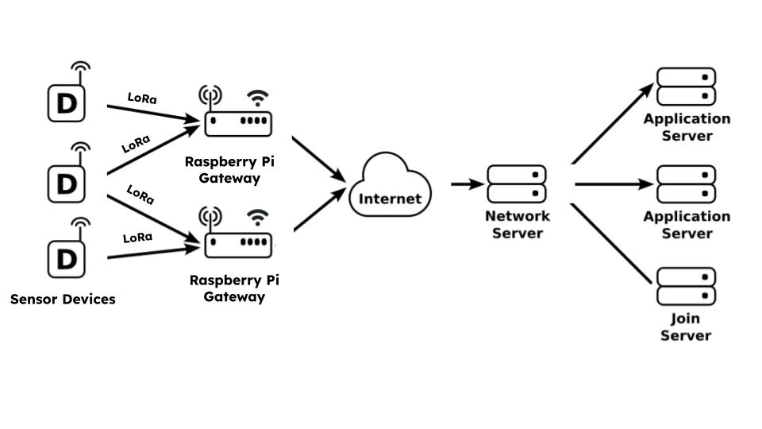

# SiPaRCS 2024 Research: <br/><br/>Environmental Data Sensing and Monitoring System Using Community-based Private LoRa Network


## Project Description

This project  develops a mesonet of IoT weather monitoring sensors that collect various environmental data, including temperature, humidity, altitude, air quality, UV levels, and rain data. The collected data will be transmitted via a community-maintained private LoRa (Long Range) network to intermediary custom Raspberry Pi gateways. These Raspberry Pi devices forward the aggregated data over the internet to a network server, which distributes the information to application servers for further processing and analysis.

#### Key Components:
1. **Sensor Devices:** These devices measure and collect weather data. Each sensor node is equipped with LoRa communication capabilities to transmit data wirelessly.
2. **Raspberry Pi Gateways:** The Raspberry Pi devices act as local gateways, receiving data from multiple sensor devices via the LoRa network. They then transmit this data over the internet to central servers.
3. **Network Server:** This server acts as a central hub, receiving data from various Raspberry Pi gateways and distributing it to multiple application servers.
4. **Application Servers:** These servers process the weather data for various applications, including weather modeling and forecasting, real-time alert systems, and environmental monitoring.
5. **Join Server:** This server handles the network join requests from the sensor devices, ensuring secure and authenticated communication.

#### Use Cases:
1. **Weather Modeling:** The collected data can be used to create detailed weather models that help in predicting local weather patterns with greater accuracy.
2. **Real-Time Alert Systems:** The system can generate real-time alerts for severe weather conditions such as storms, heavy rainfall, or extreme temperatures, helping communities to prepare and respond promptly.
3. **Environmental Monitoring:** Continuous monitoring of air quality, UV levels, and other environmental factors can help in assessing the impact of pollution and climate change, facilitating environmental protection efforts.
4. **Agricultural Applications:** Farmers can use the data to optimize irrigation schedules, protect crops from adverse weather conditions, and improve overall agricultural productivity.
5. **Urban Planning:** City planners can utilize the data for designing resilient infrastructure that can withstand local weather conditions and mitigate the impact of natural disasters.

-   [This project is an extension of the existing OpenIoTwx project
    (https://ncar.github.io/openiotwx/)](https://ncar.github.io/openiotwx/)




# Research Questions

LoRa is a low cost efficient addition to the openIoTwx platform which can be implemented with minimal effort.  **We acknowledge** that there are a number of excellent IoT platforms for deploying and managing IoT devices such [ResIoT](https://www.resiot.io/en/home/), [KaaIoT](https://kaaiot.com), [The Things Network](https://thethingsnetwork.org), [ThingsBoard](https://thingsboard.io), [ThingsSpeak](https://thingspeak.com), among others, as well as LoRa networks such as [LoRa Alliance](https://lora-alliance.org), [Azure IoT](), [SenseCAP](), [Meshtastic](https://meshtastic.org) and others.  

The primary goal here is to _develop a locally-operated network of LoRa IoT devices to experiment and understand costs, design details, implementation details and use cases_.

Can we do some remote inference of ML models on th Pis?


|  # |   RQ | Narrative |
| :---: | --------- | -------- |
| 1a | What are the technologies required to develop a community-based private LoRa network? | [./notebooks/RQ1.ipynb](./notebooks/00_extract.ipynb) |
| 1b | What are the software and hardware architectures that can provide commodity hardware Pi-based community-private environmental data sensing LoRa networks? | [./notebooks/RQ1.ipynb](./notebooks/RQ1.ipynb) |
| 1c | What is the risk/benefit of Pi-based community-private LoRa implementations for environmental data sensing versus public LoRa / Mesh networks? | [./notebooks/RQ1.ipynb](./notebooks/RQ1.ipynb) |
| 1d| What are the data collection, transmission and reliability characteristics of  community-private LoRa implementations compared to more advanced commercial or open source alternatives? | [./notebooks/RQ1.ipynb](./notebooks/RQ1.ipynb) |
| 2* | What edge-ML technologies can be implemented within LoRa environmental data sensing contexts for edge inference on th Pis-based hardware?  | [./notebooks/RQ2.ipynb](./notebooks/RQ2.ipynb) |


# Hardware 

| Type | Device/Instrument | Purpose | Setup Information |
| :-- | :-- | :-- | :-- |
| SBC | [Raspberry Pi 3 Model B](https://www.raspberrypi.com/products/raspberry-pi-3-model-b/) | provides main  hardware and OS platform for tranceiver | -- | 
| SBC | [Raspberry Pi Zero 2w ](https://www.raspberrypi.com/products/raspberry-pi-zero-2-w/) | provides smaller form factor hardware and DietPi OS platform for gateway tranceiver | -- | 
| Sensor  | [Adafruit Qwiic BME 680](https://www.adafruit.com/product/3660) | Atmospheric measurements | -- |
| Sensor  | [Air Quality Adafruit PMSA003I](https://www.adafruit.com/product/4632) | Atmospheric measurements | -- |
| Sensor  | [UV Sensor adafruit ltr390 ](https://www.adafruit.com/product/4831) | Atmospheric measurements | -- |
| Sensor  | [GPS Sparkfun xa1110 ](https://www.sparkfun.com/products/14414) | Atmospheric measurements | -- |
| Sensor  | [Realtime clock Adafruit PCFT8523 ](https://www.adafruit.com/product/3295) | Atmospheric measurements | -- |
| MCU | [Adafruit Feather RP2040 LoRA board](https://learn.adafruit.com/adafruit-feather-rp2040-pico/overview) | transmit data at 915mhz over LoRA | -- |
| MCU | [Sparkfun ExpLoRaBLE WRL17506 Thing Plus LoRA Board](https://www.sparkfun.com/products/17506) | transmit data at 915mhz over LoRA | -- |


---

# Code

The source code for the different implementations can be found as follows:

## Transceivers

| Vendor | Board | Frequency | Status | Code Link |
| :---: | :---: | :--- | :--- | :--- |
| AdaFruit | Adafruit LoRa Radio Bonnet with OLED - RFM95W | 915MHz (GPIO Hat) | Working | [./code/transceiver/rpi/](./code/transceiver/rpi) |

## Receivers

| Vendor | Board | Frequency | Status | Code Link |
| :---: | :---: | :--- | :--- | :--- |
| AdaFruit | ARM Adafruit Feather RP2040 with RFM95 LoRa Radio | 915MHz | In Progress | [./code/transmitter/arduino/adafruit_rp2040_lora](./code/transmitter/arduino/adafruit_rp2040_lora) |

## Modalities

The RP2040 boards act as transmitters, collecting environmental data and sending it via LoRa. The Raspberry Pi devices act as receivers, relaying this data to the internet through a hotspot connection.


<!-- # Data 

Data to be compared with the NEON station


|  Data |   Summary | Location |
| :---: | ----------|----------|
| EPA source | This folder contains EPA source data. | [./data/epa/](./data/epa) | -->


# PiLoRa Setup and Installations

Follow these steps to set up and install the necessary components for your PiLoRa project:

1. **Create a Virtual Environment:**
   - On your Raspberry Pi with the bonnet connected, create a virtual environment named `adafruit`:
     ```
     python -m venv adafruit
     ```
2. **Activate the Virtual Environment:**
   - Navigate to your virtual environment's bin directory and activate it:
     ```
     cd adafruit/bin
     source activate
     ```

3. **Install Required Libraries:**
   - Install the necessary libraries using the following commands:
     ```
     pip3 install adafruit-circuitpython-ssd1306
     pip3 install adafruit-circuitpython-framebuf
     pip3 install adafruit-circuitpython-rfm69
     pip3 install paho-mqtt
     ```


4. **Enable SPI and I2C:**
   - Enable SPI by executing the Raspberry Pi configuration tool:
     ```
     sudo raspi-config
     ```
   - Navigate to `Interface Options` and enable SPI and I2C.

5. **Run the Transceiver Script:**
   - Execute the Python script to see your Raspberry Pi with the bonnet act as a transceiver for LoRa packets:
     ```
     python3 LoRA_bonnet_transceiver.py
     ```

# RP2040 Setup and Installations

To set up the RP2040 board in the Arduino IDE, follow these steps:

1. **Add the Board Manager URL:**
   - Open the Arduino IDE.
   - Navigate to `File > Preferences`.
   - In the `Additional Boards Manager URLs` field, add the following URL
     ```
     https://github.com/earlephilhower/arduino-pico/releases/download/global/package_rp2040_index.json
     ```
  

2. **Install the RP2040 Board Package:**
   - In the Arduino IDE, go to `Tools > Board > Boards Manager`.
   - Search for `RP2040`.
   - Find the entry for `Raspberry Pi Pico/RP2040 by Earle F Philhower, III`.
   - Click `Install`.

3. **Select the Adafruit Feather RP2040 RFM Board:**
   - Go to `Tools > Board`.
   - Scroll down and select `Raspberry Pi RP2040 Boards`.
   - Choose `Adafruit Feather RP2040 RFM` from the list.

4. **Enter Bootloader Mode:**
   - To upload code, the RP2040 needs to be in bootloader mode.
   - Hold down the “Boot” button on the RP2040 while plugging it into your computer via USB.

5. **Upload the Code:**
   - Once in bootloader mode, compile and upload the sketch `Feather_tx.ino` to the board.

6. **Verify Data Transmission:**
   - After uploading the sketch, you should be able to receive the data packets sent from the RP2040 on your Raspberry Pi.


# Manuscript

The manuscript for this project can be found:

* (pdf) draft [./manuscript/manuscript.pdf](./manuscript/manuscript.pdf)

# Citing This Work

If you use this work, please cite it using the following citation:

> Hossain, A.m et al SiPARCS Research Repository. [DOI coming soon]

# License

CC-BY-4.0

&copy; Abrar Hossain, Keith E. Maull, Agbeli Ameko
